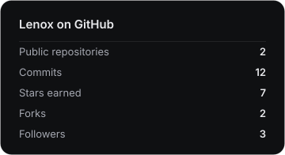
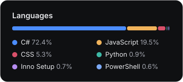

  

 

I'm a **vibecoder**. I describe what I want, iterate with AI in the loop, test it against reality, and ship it. Most of what lands here is Windows desktop software and FiveM scripts, and all of it is meant to feel instant.

 

## Projects

2 public repositories, listed by stars and recent activity. This page rebuilds itself from GitHub every few hours.

<table>
<tr>
<td width="50%" valign="top">
  <h3><a href="https://github.com/lenox3/qb-notify">qb-notify</a></h3>
  
Notifications script for QBCore framework.

  
<code>CSS</code> · ★ 7 · updated Nov 2024

</td>
<td width="50%" valign="top">
  <h3><a href="https://github.com/lenox3/Bvoice">Bvoice</a></h3>
  
Local, private AI voice typing for Windows. Hold a key, speak naturally, pause to think, release.

  
<code>C#</code> · updated Sep 2026

</td>
</tr>
</table>

## Languages across my repos

       

## Activity

  
  

Generated 2026-09-12 06:59 UTC by <a href="scripts/build_readme.py">scripts/build_readme.py</a>.

